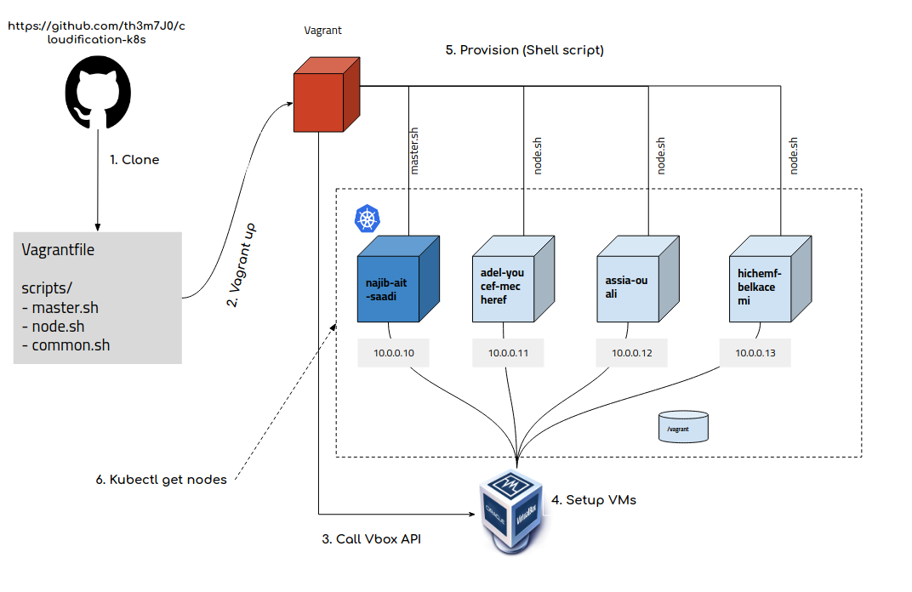

# project-vagrant-docker-k8s

Here is the summary of the setup.
1. Using Kubeadm, a single vagrant up command will generate three VMs and configure the necessary kubernetes components and configuration
2. As part of the configuration, the Calico Network Plugin, Metrics server, and Kubernetes dashboard are installed.
3. The `kubeconfig` file is loaded on all nodes in the cluster, allowing you to run `kubectl` commands from any of them.
4. The `kubeconfig` file and the kubernetes dashboard access token are added to the Vagrantfiles `configs/` folder. The `kubeconfig` file can be used to connect your workstation to the cluster.
5. When the VMs are not in use, you can turn them off and on as needed. There are no difficulties with any of the cluster configurations. During the setup process, the nodes are automatically connected to the master.
6. You may delete all of the VMs with a single command `vagrant destroy` and then recreate the setup with a `vagrant up` command at any moment.

NB: 
note that for each master/node a user is added (eg. adel-youcef-mecheref) you can ssh to the box using the private key of the machine, you will find the ssh config using command: `vagrant ssh-config`

